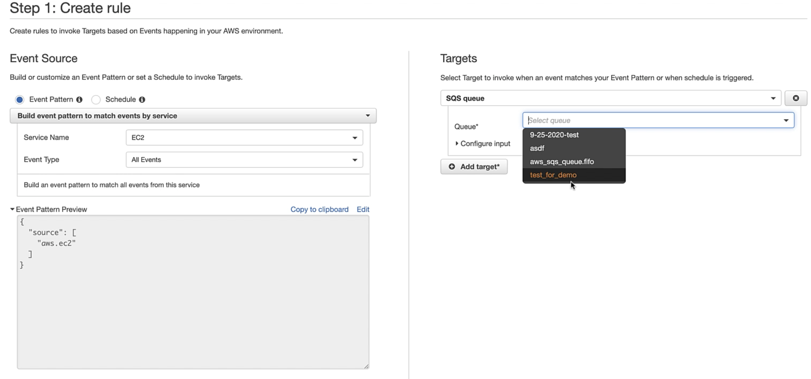
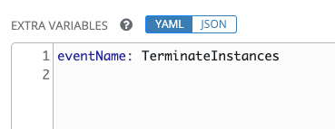

# Demo using Ansible and Knative for AnsibleFest 2020

## Requirements

* OpenShift Serverless (Knative)
* Ansible
* kn (Knative CLI)
* AWS AccessKey (if using CloudTrail events)

## Part 1: Consuming AWS EC2 events using SQS and Knative

1. Create an SQS Queue in AWS (Amazon Web Services)

  Amazon SQS > Queues > Create queue

  For our demonstration we did a Standard queue.

2. Retrieve the SQS URL

  Will look something like https://sqs.us-east-1.amazonaws.com/23423423/your_name

3. Configure Cloud Watch to send events to the SQS queue:

  For our demonstration we did AWS EC2 events, here is a screen shot:

  

4. Ensure Messages are showing up in your SQS Queue.  You need to do this before you configure Knative because they will consume all messages in the queue.

5. Setup your Applications.  

  With the demonstration video we have two applications.
  1. One application is for debugging purposes and simply prints the events for us to see
  2. The 2nd application talks to Red Hat Ansible Automation Platform

6. Configure AWS SQS Source for the applciations.

### Steps

## Part 2: Cloud events kicking off Automation

This is event driven automation using Knative!

Knative consumes Cloud Events then talks to Red Hat Ansible Automation Platform through the API.

### Steps

1. [Setup/Install Red Hat Ansible Automation Platform](https://docs.ansible.com/ansible-tower/latest/html/quickinstall/index.html)
2. Create a [Job Template](https://docs.ansible.com/ansible-tower/latest/html/userguide/job_templates.html) with this project

  ```
  https://github.com/ipvsean/ansible_aws_report
  ```

  Three things required for a Job Template:
  1. **Credentials**:
    a. AWS credential for the role Ansible Playbook to use
    b. Linux host credential to login and configure/install Apache for the report
  2. **Inventory**: any modern RHEL host will work
  3. **Project**: use the provided Github repo and select the `build_report.yml` Ansible Playbook

3. Make sure that the Job Template has selected (checkmark) `PROMPT ON LAUNCH` for extra variables.  This is how Knative can pass key, value pairs (variables) to Red Hat Ansible Automation Platform.

 

4. Retrieve the API URL to launch this job

  Use Ansible Tower's browsable API:
  https://your_tower_server/api/v2/job_templates

  Figure out which Job Template you need to launch.  You can see how this works in the app.py here:

  https://github.com/markito/ansiblefest2020/blob/master/sinkToTower/app.py#L54

   ```
   ENDPOINT=os.environ.get('ENDPOINT', "https://ansible.rhdemo.io/api/v2/job_templates/193/launch/")
   ```
  This allows the Knative container to kick off an Ansible Job Template.  While you can use a Job Template ID (e.g. an integer like 193) you can also use named_urls: [https://docs.ansible.com/ansible-tower/latest/html/towerapi/access_resources.html](https://docs.ansible.com/ansible-tower/latest/html/towerapi/access_resources.html).  If you click on the Job Template ID in the browsable API you can retrieve the `named_url`.

5. Update the application with the correct endpoint URL

```
kn service update sinktower --image=markito/sink2tower:v1 --env ENDPOINT="https://your_tower_url.com/api/v2/job_templates/Knative%20-%20AWS%20Report++Default/launch/"
Updating Service 'sinktower' in namespace 'ipvsean-markito':
```

6. Make some Events!

For this demonstration we just triggered off any event.  This behavior can be changed in Amazon SQS or the application or even Red Hat Ansible Automation Platform depending on the situation!  As long as we pass the event through an extra variable we can use the information anywhere.


### Go Further!

The `ansible_aws_report` is also an Ansible Collection and can be found on Ansible Galaxy:

Install the `ansible_aws_report` collection

   https://galaxy.ansible.com/ipvsean/ansible_aws_report

   command:
   ```
   ansible-galaxy collection install ipvsean.ansible_aws_report
   ```

   or you can use a requirements method.  See the blog here for more information and a walkthrough of setting up Ansible Tower with collections [https://www.ansible.com/blog/hands-on-with-ansible-collections](https://www.ansible.com/blog/hands-on-with-ansible-collections)


# Authors

- [@William_Markito](https://twitter.com/william_markito)
- [@IPvSean](https://twitter.com/ipvsean)
